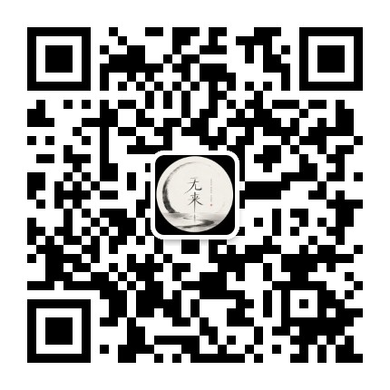

  

<h1 align="center">无来</h1>

在日常里修行，在体会中写下佛法

<a href="https://lumisum.github.io/wulai/">进入「无来」阅读网站 ↗</a>

---

## 关于无来

这里记录我修行、学习佛法的过程，也记录佛法如何回到真实的日常。

我相信，修学不只是寻找现成的答案，也是在每一次观照、选择与实践中，慢慢看清自己的心。文章从个人经历与理解出发，尽量以真诚、平实的文字分享体会；所写是持续学习中的阶段记录，愿与有缘人一起思考、一起前行。

<strong>微信公众号：无来</strong>

---

## 文章目录

| 分组 | 文章 |
| --- | --- |
| [修行与日常](articles/practice/README.md) | 暂无文章 |
| [经义与学习](articles/study/README.md) | 暂无文章 |
| [观心与体会](articles/insights/README.md) | 暂无文章 |
| [佛法与生活](articles/life/README.md) | [有了佛学基础，情商会不会提高？](https://lumisum.github.io/wulai/articles/life/2026-09-24-fuxue-yu-qingshang/) |
