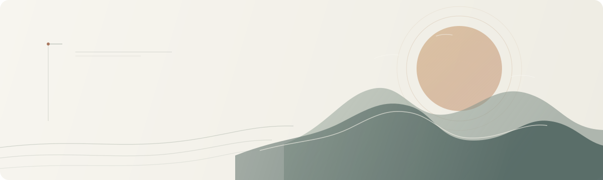

<div align="center">



# 无来

### 在日常里修行，在体会中写下佛法

一个关于个人修行、佛法学习与生活观察的开放记录。  
从真实的困惑与经验出发，把尚在生长的理解，慢慢写成文章。

[浏览文章目录](#文章目录) · [了解这个项目](#关于无来) · [关注微信公众号](#微信公众号) · [查看配图风格](guides/image-style.md)

</div>

---

> 不急着给答案。先安静下来，看看此刻的心，也看看正在经历的生活。

## 关于无来

佛法不只在书页与远方，也在一次情绪升起时、一段关系之中，以及每天如何面对自己和他人。

「无来」是一个持续整理个人修学过程的地方：记录读经闻法的思考，也记录把所学带回日常之后的体会。这里的文章来自个人经验与理解，会随着学习继续修订；它们是诚实的阶段性记录，不是标准答案，也不替代经典、善知识或专业指导。

## 微信公众号

想在公众号阅读文章与后续更新，可以扫码关注。公众号名称是中文 **「无来」**。

<div align="center">


**微信公众号：无来**

</div>

## 文章目录

从你此刻关心的话题开始阅读。每个主题的索引会持续收录新文章。

| 主题 | 这里会写什么 | 文章索引 |
| --- | --- | --- |
| **修行与日常** | 日常功课、习惯养成，以及如何把修行落实到生活里 | [进入主题 →](articles/practice/README.md) |
| **经义与学习** | 经文阅读、佛法概念，以及学习过程中的理解整理 | [进入主题 →](articles/study/README.md) |
| **观心与体会** | 念头、情绪、执着，以及个人修习中的观察 | [进入主题 →](articles/insights/README.md) |
| **佛法与生活** | 如何以佛法观照关系、工作、选择和日常处境 | [进入主题 →](articles/life/README.md) |

> 文章索引正在搭建中。新的文字会先从具体的人与事出发，再慢慢回到所学与所思。

## 阅读这份记录

- **从个人经验出发：**尽量把抽象的道理放回具体生活，不把体会包装成放之四海而皆准的结论。
- **分清经典与体会：**引用经文或他人观点时标明出处；个人理解也会明确作为个人理解呈现。
- **允许持续修订：**学习与实践仍在继续，旧文章也可能随着新的认识而更新。

如果某篇文章让你停下来多看了自己一眼，那便已经有了它的意义。愿这些记录成为一盏小灯，不替人走路，只照见眼前一步。

## 文字之外的画面

每篇文章通常配一张公众号横版封面，以及约三张正文插图：封面为 **2.35:1**，正文图为 **3:4 竖版**。画面追求安静、清透、当代与留白，从自然光、山水、风、水纹、树影和日常物件中寻找意境；避免重复套用佛像、莲花等固定符号，也不在生成图中直接放文字。

[阅读完整配图风格指南 →](guides/image-style.md)

新文章配图时，可使用项目内的[无来公众号配图技能](.agents/skills/wulai-wechat-visuals/SKILL.md)。

## 项目结构

```text
.
├── README.md                    # 项目首页与文章总目录
├── articles/                    # 按主题整理的文章与各主题索引
├── guides/                      # 写作与配图规范
├── .agents/skills/              # 无来项目专用配图技能
└── templates/                   # 新文章模板
```

新文章使用[文章模板](templates/article-template.md)，并收录到对应主题索引。单篇文章的正文、发布信息与配图放在同一个目录，便于阅读、修改和持续整理。

---

<div align="center">

**愿每一次回到当下，都让理解多一分清明，让生活多一分自在。**

</div>
